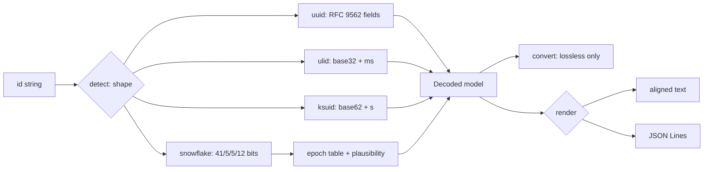

# idpeek

[English](README.md) | [中文](README.zh.md) | [日本語](README.ja.md)

[](LICENSE) [](go.mod) [](CHANGELOG.md)  [](CONTRIBUTING.md)

**idpeek：UUID・ULID・KSUID・Snowflake をデコードするオープンソース・ゼロ依存の CLI —— バージョン、埋め込みタイムスタンプ、マシンビット、無損失変換。ログに現れるあらゆる ID をバイナリ 1 つで。**


```bash
git clone https://github.com/JaydenCJ/idpeek && cd idpeek
go build -o idpeek ./cmd/idpeek    # single static binary, stdlib only
```

> プレリリース：v0.1.0 はまだパッケージレジストリに公開されていません。上記の手順でソースからビルドしてください（Go ≥1.22 なら可）。

## なぜ idpeek？

「この ID はいつ作られた？」はデバッグのたびに出てくる問いであり、UUIDv7 の普及でタイムスタンプ入り ID はもはや主流のデフォルトです——それでも現実は 16 進数とにらめっこ。既存ツールはフォーマットごとにバラバラです：`uuidparse`（util-linux）は UUID を読めても、実際によく見る v6/v7 で「unknown time」を返しがち；リファレンス実装の `ulid` と `ksuid` の CLI はそれぞれ 1 フォーマット専用で、別々にインストールが必要；Snowflake は結局 Web の「tweet ID を日付に」変換サイト頼みで、Discord ID には無力、隔離環境の本番ログ由来の ID には論外です。idpeek は静的バイナリ 1 つで 4 つの形状をすべて自動判別し（互いに排他なので推測はしない）、根拠となる仕様の節つきで全フィールドをデコードし、Snowflake の時刻を既知の全 epoch で妥当性判定つきで表示し、表現間を無損失に変換します——ULID↔UUID はビット単位で一致、UUIDv1↔v6 は RFC 9562 の公式ベクタで検証済み。

| | idpeek | uuidparse | ulid CLI | ksuid CLI | Web 変換サイト |
|---|---|---|---|---|---|
| UUID + ULID + KSUID + Snowflake をツール 1 つで | ✅ | ❌ UUID のみ | ❌ ULID のみ | ❌ KSUID のみ | ❌ サイトごとに 1 種 |
| UUIDv7 / v6 タイムスタンプ | ✅ | 部分的 | ❌ | ❌ | まちまち |
| Snowflake マルチ epoch（twitter/discord/instagram/カスタム） | ✅ | ❌ | ❌ | ❌ | ❌ サイト固定 |
| 無損失変換（ULID↔UUID、v1↔v6） | ✅ | ❌ | ❌ | ❌ | ❌ |
| スクリプト向け JSON 出力 | ✅ | ❌ | ❌ | ✅ | ❌ |
| オフラインで本番 ID も安心 | ✅ | ✅ | ✅ | ✅ | ❌ ID をサイトに貼る羽目に |
| ランタイム依存 | 0 | 0（util-linux 同梱） | Go モジュール依存 | Go モジュール依存 | n/a |

<sub>2026-07-12 時点で確認：idpeek は Go 標準ライブラリのみを import。リファレンスの ulid・ksuid CLI はフォーマット別の Go モジュールで、それぞれ依存ツリーを持ちます。</sub>

## 特徴

- **全フィールドに根拠つき** —— UUID バージョン 1-8 と Nil/Max、variant ビット、クロックシーケンス、node のマルチキャストビット解析（「ランダム node、MAC ではない」）、ULID の乱数部、KSUID の payload、Snowflake の worker/sequence —— すべて RFC 9562・ULID 仕様・KSUID ドキュメント・Discord API ドキュメントのベクタでテスト済み。
- **本来の精度でタイムスタンプを報告** —— UUIDv1/v6 は 100 ns、v7/ULID/Snowflake はミリ秒、KSUID は秒；常に UTC、常に生の `unix_ms` を併記。
- **Snowflake の epoch に誠実** —— epoch は ID 自体から復元できないため、idpeek は既知の全 epoch での読みを表示し、それぞれに `plausible` / `implausible` を付けます。黙って 1 つを選んだりしません。
- **変換は無損失のみ** —— ULID↔UUID は同じ 128 ビット、UUIDv1↔v6 は同一フィールドの並べ替え、全フォーマットに hex 形式あり；ビット幅が合わない変換は拒否し、切り詰めは決して行いません。
- **パイプのために設計** —— `idpeek time` は ID ごとにソート可能な 1 行、`--format json` は 1 行 1 オブジェクト（JSON Lines）、`-` で stdin から ID を読み、終了コードで不正 ID（1）と不正フラグ（2）を区別。
- **ゼロ依存・完全オフライン** —— Go 標準ライブラリのみ；本番 ID がマシンの外に出ることはありません。テレメトリなし、ネットワークアクセスは一切なし。

## クイックスタート

```bash
idpeek 01ARZ3NDEKTSV4RRFFQ69G5FAV
```

実際にキャプチャした出力：

```text
input        01ARZ3NDEKTSV4RRFFQ69G5FAV
kind         ulid
timestamp    2016-07-30T23:54:10.259Z  (unix_ms 1469922850259, millisecond precision)
randomness   0xd6764c61efb99302bd5b  (80 bits)
as UUID      01563e3a-b5d3-d676-4c61-efb99302bd5b  (same 128 bits)
as hex       0x01563e3ab5d3d6764c61efb99302bd5b
```

作成時刻だけを、epoch 補正つき・スクリプト即投入可で（実出力）：

```bash
idpeek time --epoch discord 175928847299117063   # → 2016-04-30T11:18:25.796Z
idpeek time --unix-ms 017f22e2-79b0-7cc3-98c4-dc0c0c07398f   # → 1645557742000
```

表現間の変換（実出力）：

```bash
idpeek convert --to uuidv6 c232ab00-9414-11ec-b3c8-9f6bdeced846
# → 1ec9414c-232a-6b00-b3c8-9f6bdeced846   (RFC 9562's own v1/v6 vector pair)
```

## 対応フォーマット

完全なビットレイアウトと出典は [docs/formats.md](docs/formats.md) を参照。

| フォーマット | 判別する形状 | 埋め込み時刻 | 追加でデコードする内容 |
|---|---|---|---|
| UUID（RFC 9562） | 36 文字 / 32 hex / `urn:uuid:` / `{…}` | v1/v6（100 ns）、v7（ms） | バージョン、variant、クロックシーケンス、node、DCE domain、rand_a/b |
| ULID | 26 文字の Crockford base32 | 48 ビットのミリ秒 | 80 ビット乱数；i/l/o 入力も寛容に受理 |
| KSUID | 27 文字の base62 | 2014-05-13 起点の 32 ビット秒 | 128 ビット payload；正確なオーバーフロー境界 |
| Snowflake | 1-19 桁の数字（int64） | epoch 起点の 41 ビットミリ秒 | datacenter/worker/sequence、epoch 別対照表 |

## CLI リファレンス

`idpeek [decode|time|convert|version] [flags] <id>... | -` —— デフォルトのサブコマンドは `decode`。終了コード：0 成功、1 デコード/変換失敗、2 用法エラー。

| フラグ | デフォルト | 効果 |
|---|---|---|
| `--kind` | 自動 | `uuid`/`ulid`/`ksuid`/`snowflake` を強制し、判別をスキップ |
| `--epoch` | `twitter` | Snowflake の epoch：`twitter`・`discord`・`instagram`・`unix`、または Unix ミリ秒オフセット |
| `--format` | `text` | `decode` の出力：`text` または `json`（1 行 1 オブジェクト） |
| `--unix-ms` | オフ | `time`：RFC 3339 の代わりに Unix ミリ秒を出力 |
| `--to` | — | `convert` の変換先：`uuid`・`ulid`・`hex`・`uuidv6`・`uuidv1` |

## 検証

このリポジトリは CI を同梱しません。上記の主張はすべてローカル実行で検証されています：

```bash
go test ./...            # 90 deterministic tests, offline, < 5 s
bash scripts/smoke.sh    # end-to-end CLI check, prints SMOKE OK
```

## アーキテクチャ



## ロードマップ

- [x] v0.1.0 —— UUID v1-v8/Nil/Max・ULID・KSUID・Snowflake のデコード；マルチ epoch 解釈；ULID↔UUID と UUIDv1↔v6 の変換；text/JSON 出力；90 テスト + smoke スクリプト
- [ ] 64 ビット方言の追加：Sonyflake（39/8/16）、LinkedIn/Mastodon の epoch
- [ ] MongoDB ObjectId、Firebase push ID、TSID のデコード
- [ ] `idpeek new` —— テストフィクスチャ用の ID 生成（v4/v7/ULID）
- [ ] バッチ統計モード：パイプ入力の集合に対する時間範囲・ID レート・欠落
- [ ] シェル補完と `--color` モード

完全なリストは [open issues](https://github.com/JaydenCJ/idpeek/issues) を参照。

## コントリビュート

Issue・ディスカッション・PR を歓迎します —— ローカルのワークフロー（フォーマット、vet、テスト、`SMOKE OK`）は [CONTRIBUTING.md](CONTRIBUTING.md) を参照。入門タスクには [good first issue](https://github.com/JaydenCJ/idpeek/issues?q=is%3Aissue+is%3Aopen+label%3A%22good+first+issue%22) ラベルがあり、設計の議論は [Discussions](https://github.com/JaydenCJ/idpeek/discussions) へ。

## ライセンス

[MIT](LICENSE)
