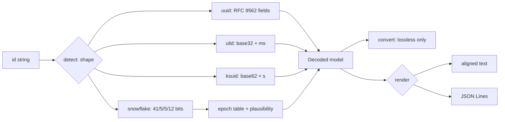

# idpeek

[English](README.md) | [中文](README.zh.md) | [日本語](README.ja.md)

[](LICENSE) [](go.mod) [](CHANGELOG.md)  [](CONTRIBUTING.md)

**idpeek：an open-source, zero-dependency CLI that decodes UUIDs, ULIDs, KSUIDs, and Snowflakes — versions, embedded timestamps, machine bits, and lossless conversions, one binary for every ID your logs throw at you.**


```bash
git clone https://github.com/JaydenCJ/idpeek && cd idpeek
go build -o idpeek ./cmd/idpeek    # single static binary, stdlib only
```

> Pre-release: v0.1.0 is not tagged on a package registry yet; build from source as above (any Go ≥1.22).

## Why idpeek?

"When was this ID created?" comes up in every debugging session, and with UUIDv7 adoption, timestamp-bearing IDs are now the mainstream default — yet the usual answer is still squinting at hex. The existing tooling is fragmented per format: `uuidparse` (util-linux) reads UUIDs but reports v6/v7 as "unknown time" on many versions in the wild; the reference `ulid` and `ksuid` CLIs each speak exactly one format and are separate installs; Snowflakes usually end in a web "tweet ID to date" converter, which is useless for Discord IDs and a non-starter for IDs from production logs on an air-gapped box. idpeek is one static binary that auto-detects all four shapes (they are mutually exclusive, so detection never guesses), decodes every field with the spec section to back it, prints Snowflake times under every known epoch with a plausibility verdict, and converts losslessly between representations — ULID↔UUID bit-for-bit, UUIDv1↔v6 verified against the RFC 9562 vectors.

| | idpeek | uuidparse | ulid CLI | ksuid CLI | web converters |
|---|---|---|---|---|---|
| UUID + ULID + KSUID + Snowflake in one tool | ✅ | ❌ UUID only | ❌ ULID only | ❌ KSUID only | ❌ one page each |
| UUIDv7 / v6 timestamps | ✅ | partial | ❌ | ❌ | varies |
| Snowflake multi-epoch (twitter/discord/instagram/custom) | ✅ | ❌ | ❌ | ❌ | ❌ fixed site |
| Lossless conversions (ULID↔UUID, v1↔v6) | ✅ | ❌ | ❌ | ❌ | ❌ |
| JSON output for scripting | ✅ | ❌ | ❌ | ✅ | ❌ |
| Offline, safe for production IDs | ✅ | ✅ | ✅ | ✅ | ❌ pastes IDs to a website |
| Runtime dependencies | 0 | 0 (in util-linux) | Go module deps | Go module deps | n/a |

<sub>Checked 2026-07-12: idpeek imports the Go standard library only; the reference ulid and ksuid CLIs are per-format Go modules with their own dependency trees.</sub>

## Features

- **Every field, with receipts** — versions 1-8 plus Nil/Max UUIDs, variant bits, clock sequence, node multicast analysis ("random node, not a MAC"), ULID randomness, KSUID payload, Snowflake worker/sequence — each vector-tested against RFC 9562, the ULID spec, the KSUID docs, and Discord's API docs.
- **Timestamps at true precision** — 100 ns for UUIDv1/v6, milliseconds for v7/ULID/Snowflake, seconds for KSUID; always UTC, always with the raw `unix_ms` alongside.
- **Epoch honesty for Snowflakes** — the epoch is not recoverable from the ID, so idpeek prints the reading under every known epoch and marks each `plausible` or `implausible` instead of silently picking one.
- **Lossless conversions only** — ULID↔UUID share 128 bits, UUIDv1↔v6 reorder the same fields, everything has a hex form; width-mismatched conversions are refused, never truncated.
- **Built for pipes** — `idpeek time` prints one sortable line per ID, `--format json` emits one object per line (JSON Lines), `-` reads IDs from stdin, and exit codes separate bad IDs (1) from bad flags (2).
- **Zero dependencies, fully offline** — Go standard library only; your production IDs never leave the machine. No telemetry, no network, ever.

## Quickstart

```bash
idpeek 01ARZ3NDEKTSV4RRFFQ69G5FAV
```

Real captured output:

```text
input        01ARZ3NDEKTSV4RRFFQ69G5FAV
kind         ulid
timestamp    2016-07-30T23:54:10.259Z  (unix_ms 1469922850259, millisecond precision)
randomness   0xd6764c61efb99302bd5b  (80 bits)
as UUID      01563e3a-b5d3-d676-4c61-efb99302bd5b  (same 128 bits)
as hex       0x01563e3ab5d3d6764c61efb99302bd5b
```

Just the creation time, epoch-corrected, script-ready (real output):

```bash
idpeek time --epoch discord 175928847299117063   # → 2016-04-30T11:18:25.796Z
idpeek time --unix-ms 017f22e2-79b0-7cc3-98c4-dc0c0c07398f   # → 1645557742000
```

Convert between representations (real output):

```bash
idpeek convert --to uuidv6 c232ab00-9414-11ec-b3c8-9f6bdeced846
# → 1ec9414c-232a-6b00-b3c8-9f6bdeced846   (RFC 9562's own v1/v6 vector pair)
```

## Supported formats

Full bit layouts and sources in [docs/formats.md](docs/formats.md).

| Format | Shape detected | Embedded time | Extras decoded |
|---|---|---|---|
| UUID (RFC 9562) | 36 chars / 32 hex / `urn:uuid:` / `{…}` | v1/v6 (100 ns), v7 (ms) | version, variant, clock seq, node, DCE domain, rand_a/b |
| ULID | 26 Crockford base32 | 48-bit ms | 80-bit randomness; lenient i/l/o input |
| KSUID | 27 base62 | 32-bit s since 2014-05-13 | 128-bit payload; exact overflow bounds |
| Snowflake | 1-19 digits (int64) | 41-bit ms since epoch | datacenter/worker/sequence, per-epoch table |

## CLI reference

`idpeek [decode|time|convert|version] [flags] <id>... | -` — `decode` is the default. Exit codes: 0 ok, 1 decode/convert failure, 2 usage error.

| Flag | Default | Effect |
|---|---|---|
| `--kind` | auto | force `uuid`/`ulid`/`ksuid`/`snowflake`, skip detection |
| `--epoch` | `twitter` | Snowflake epoch: `twitter`, `discord`, `instagram`, `unix`, or a Unix-ms offset |
| `--format` | `text` | `decode` output: `text` or `json` (one object per line) |
| `--unix-ms` | off | `time`: print Unix milliseconds instead of RFC 3339 |
| `--to` | — | `convert` target: `uuid`, `ulid`, `hex`, `uuidv6`, `uuidv1` |

## Verification

This repository ships no CI; every claim above is verified by local runs:

```bash
go test ./...            # 90 deterministic tests, offline, < 5 s
bash scripts/smoke.sh    # end-to-end CLI check, prints SMOKE OK
```

## Architecture



## Roadmap

- [x] v0.1.0 — UUID v1-v8/Nil/Max, ULID, KSUID, Snowflake decoding; multi-epoch interpretation; ULID↔UUID and UUIDv1↔v6 conversions; text/JSON output; 90 tests + smoke script
- [ ] More 64-bit dialects: Sonyflake (39/8/16) and LinkedIn/Mastodon epochs
- [ ] MongoDB ObjectId, Firebase push ID, and TSID decoding
- [ ] `idpeek new` — generate IDs (v4/v7/ULID) for test fixtures
- [ ] Batch statistics mode: time range, ID rate, and gaps over a piped set
- [ ] Shell completions and a `--color` mode

See the [open issues](https://github.com/JaydenCJ/idpeek/issues) for the full list.

## Contributing

Issues, discussions and pull requests are welcome — see [CONTRIBUTING.md](CONTRIBUTING.md) for the local workflow (format, vet, tests, `SMOKE OK`). Good entry points are labelled [good first issue](https://github.com/JaydenCJ/idpeek/issues?q=is%3Aissue+is%3Aopen+label%3A%22good+first+issue%22), and design questions live in [Discussions](https://github.com/JaydenCJ/idpeek/discussions).

## License

[MIT](LICENSE)
