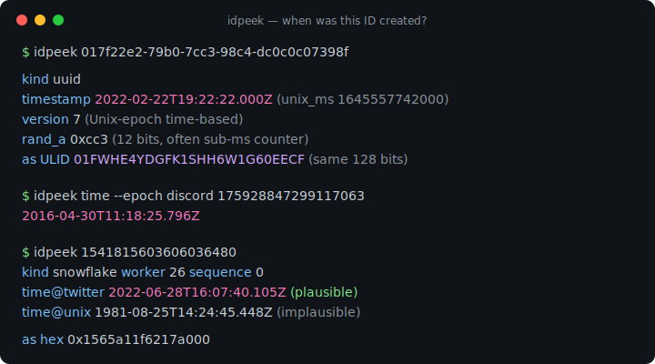
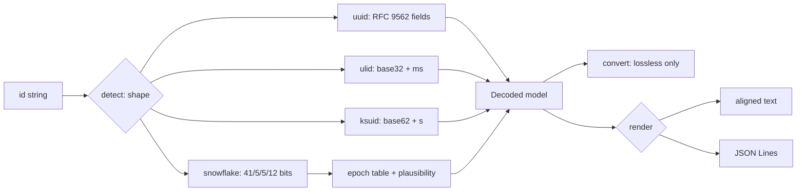

# idpeek

[English](README.md) | [中文](README.zh.md) | [日本語](README.ja.md)

[](LICENSE) [](go.mod) [](CHANGELOG.md)  [](CONTRIBUTING.md)

**idpeek：开源、零依赖的 CLI，解码 UUID、ULID、KSUID 和 Snowflake —— 版本、内嵌时间戳、机器位、无损转换，一个二进制搞定日志里出现的所有 ID。**



```bash
git clone https://github.com/JaydenCJ/idpeek && cd idpeek
go build -o idpeek ./cmd/idpeek    # single static binary, stdlib only
```

> 预发布：v0.1.0 尚未发布到任何包注册表；请按上述方式从源码构建（任意 Go ≥1.22）。

## 为什么选 idpeek？

“这个 ID 是什么时候创建的？”每一次调试都会遇到，而随着 UUIDv7 的普及，带时间戳的 ID 已成为主流默认——但常见做法仍然是对着十六进制发呆。现有工具按格式各自为政：`uuidparse`（util-linux）能读 UUID，但对野外常见的 v6/v7 常报 “unknown time”；参考实现的 `ulid` 和 `ksuid` CLI 各只会一种格式，还要分别安装；Snowflake 通常只能靠网页版 “tweet ID 转日期” 转换器，对 Discord ID 无用，对隔离环境里生产日志中的 ID 更是无从下手。idpeek 是一个静态二进制，自动识别全部四种形状（它们互斥，检测从不靠猜），解码每个字段并给出可查证的规范出处，按每个已知 epoch 打印 Snowflake 时间并附可信度判定，且在表示之间无损转换——ULID↔UUID 逐位一致，UUIDv1↔v6 已对照 RFC 9562 官方向量验证。

| | idpeek | uuidparse | ulid CLI | ksuid CLI | 网页转换器 |
|---|---|---|---|---|---|
| UUID + ULID + KSUID + Snowflake 一个工具全覆盖 | ✅ | ❌ 仅 UUID | ❌ 仅 ULID | ❌ 仅 KSUID | ❌ 每站一种 |
| UUIDv7 / v6 时间戳 | ✅ | 部分 | ❌ | ❌ | 不一定 |
| Snowflake 多 epoch（twitter/discord/instagram/自定义） | ✅ | ❌ | ❌ | ❌ | ❌ 站点写死 |
| 无损转换（ULID↔UUID、v1↔v6） | ✅ | ❌ | ❌ | ❌ | ❌ |
| 面向脚本的 JSON 输出 | ✅ | ❌ | ❌ | ✅ | ❌ |
| 离线、可放心处理生产 ID | ✅ | ✅ | ✅ | ✅ | ❌ 要把 ID 贴到网站 |
| 运行时依赖 | 0 | 0（util-linux 自带） | Go 模块依赖 | Go 模块依赖 | n/a |

<sub>核对于 2026-07-12：idpeek 仅导入 Go 标准库；参考实现的 ulid 与 ksuid CLI 是按格式拆分的 Go 模块，各带自己的依赖树。</sub>

## 特性

- **每个字段都有出处** —— UUID 版本 1-8 及 Nil/Max、variant 位、时钟序列、node 组播位分析（“随机 node，不是 MAC”）、ULID 随机位、KSUID payload、Snowflake worker/sequence —— 全部用 RFC 9562、ULID 规范、KSUID 文档和 Discord API 文档的向量做了测试。
- **按真实精度报时间** —— UUIDv1/v6 为 100 ns，v7/ULID/Snowflake 为毫秒，KSUID 为秒；一律 UTC，并始终附带原始 `unix_ms`。
- **对 Snowflake 的 epoch 保持诚实** —— epoch 无法从 ID 本身恢复，因此 idpeek 按每个已知 epoch 打印读数并标注 `plausible` 或 `implausible`，而不是悄悄替你选一个。
- **只做无损转换** —— ULID↔UUID 共享 128 位，UUIDv1↔v6 只是重排相同字段，所有格式都有 hex 形式；位宽不匹配的转换一律拒绝，绝不截断。
- **为管道而生** —— `idpeek time` 每个 ID 输出一行可排序文本，`--format json` 每行一个对象（JSON Lines），`-` 从 stdin 读取 ID，退出码区分坏 ID（1）与坏参数（2）。
- **零依赖、完全离线** —— 仅 Go 标准库；生产 ID 绝不离开本机。没有遥测，永不联网。

## 快速上手

```bash
idpeek 01ARZ3NDEKTSV4RRFFQ69G5FAV
```

真实抓取的输出：

```text
input        01ARZ3NDEKTSV4RRFFQ69G5FAV
kind         ulid
timestamp    2016-07-30T23:54:10.259Z  (unix_ms 1469922850259, millisecond precision)
randomness   0xd6764c61efb99302bd5b  (80 bits)
as UUID      01563e3a-b5d3-d676-4c61-efb99302bd5b  (same 128 bits)
as hex       0x01563e3ab5d3d6764c61efb99302bd5b
```

只要创建时间，按 epoch 校正、可直接进脚本（真实输出）：

```bash
idpeek time --epoch discord 175928847299117063   # → 2016-04-30T11:18:25.796Z
idpeek time --unix-ms 017f22e2-79b0-7cc3-98c4-dc0c0c07398f   # → 1645557742000
```

在表示之间转换（真实输出）：

```bash
idpeek convert --to uuidv6 c232ab00-9414-11ec-b3c8-9f6bdeced846
# → 1ec9414c-232a-6b00-b3c8-9f6bdeced846   (RFC 9562's own v1/v6 vector pair)
```

## 支持的格式

完整位布局及出处见 [docs/formats.md](docs/formats.md)。

| 格式 | 识别的形状 | 内嵌时间 | 额外解码内容 |
|---|---|---|---|
| UUID（RFC 9562） | 36 字符 / 32 hex / `urn:uuid:` / `{…}` | v1/v6（100 ns）、v7（ms） | 版本、variant、时钟序列、node、DCE domain、rand_a/b |
| ULID | 26 位 Crockford base32 | 48 位毫秒 | 80 位随机数；宽容接受 i/l/o 输入 |
| KSUID | 27 位 base62 | 自 2014-05-13 起的 32 位秒 | 128 位 payload；精确的溢出边界 |
| Snowflake | 1-19 位数字（int64） | 自 epoch 起的 41 位毫秒 | datacenter/worker/sequence、逐 epoch 对照表 |

## CLI 参考

`idpeek [decode|time|convert|version] [flags] <id>... | -` —— 默认子命令为 `decode`。退出码：0 成功，1 解码/转换失败，2 用法错误。

| 参数 | 默认值 | 作用 |
|---|---|---|
| `--kind` | 自动 | 强制按 `uuid`/`ulid`/`ksuid`/`snowflake` 解析，跳过检测 |
| `--epoch` | `twitter` | Snowflake epoch：`twitter`、`discord`、`instagram`、`unix`，或 Unix 毫秒偏移 |
| `--format` | `text` | `decode` 输出：`text` 或 `json`（每行一个对象） |
| `--unix-ms` | 关 | `time`：输出 Unix 毫秒而非 RFC 3339 |
| `--to` | — | `convert` 目标：`uuid`、`ulid`、`hex`、`uuidv6`、`uuidv1` |

## 验证

本仓库不附带 CI；上述所有声明均由本地运行验证：

```bash
go test ./...            # 90 deterministic tests, offline, < 5 s
bash scripts/smoke.sh    # end-to-end CLI check, prints SMOKE OK
```

## 架构



## 路线图

- [x] v0.1.0 —— UUID v1-v8/Nil/Max、ULID、KSUID、Snowflake 解码；多 epoch 解读；ULID↔UUID 与 UUIDv1↔v6 转换；text/JSON 输出；90 个测试 + smoke 脚本
- [ ] 更多 64 位方言：Sonyflake（39/8/16）以及 LinkedIn/Mastodon epoch
- [ ] MongoDB ObjectId、Firebase push ID、TSID 解码
- [ ] `idpeek new` —— 为测试夹具生成 ID（v4/v7/ULID）
- [ ] 批量统计模式：对管道输入集合给出时间范围、ID 速率与空洞
- [ ] Shell 补全与 `--color` 模式

完整列表见 [open issues](https://github.com/JaydenCJ/idpeek/issues)。

## 参与贡献

欢迎 issue、讨论与 PR —— 本地工作流（格式化、vet、测试、`SMOKE OK`）见 [CONTRIBUTING.md](CONTRIBUTING.md)。入门任务打有 [good first issue](https://github.com/JaydenCJ/idpeek/issues?q=is%3Aissue+is%3Aopen+label%3A%22good+first+issue%22) 标签，设计问题请到 [Discussions](https://github.com/JaydenCJ/idpeek/discussions)。

## 许可证

[MIT](LICENSE)
